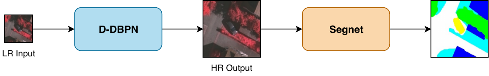

# Super Resolution + Semantic Segmentation Framework


------------

## Super Resolution (D-DBPN) instructions

### Training
Modify and run train.sh file according to the required configuration or 

```
python main.py [parameters]
```

**Parameters**: refer to main.py code

------------

### Testing
Modify and run test.sh file according to the required configuration or 

```
python eval.py [parameters]
```

**Parameters**: refer to eval.py code

------------

### Folder configuration

- dataset_name (main dataset folder)
	- train
		- {training HR images} (the images are automatically downsampled during runtime)
	- validation
		- {validation HR images} (the images are automatically downsampled during runtime)
	- test
		- {testing LR images}

------------

## Semantic Segmentation (Segnet) instructions

### Training
Modify and run train_script.sh file according to the required configuration or 

```
python  train.py [conv_name] [fold_name] [data_name] [task_name]
```

Parameters:

*conv\_name* = Semantic segmentation network name (default: segnet)

*fold\_name* = Default: 0 (for k-fold validation)

*data\_name* = Name of the folder of the dataset

*task\_name* = Name of the segmentation task (for when you have diffent segmentations for the same image), necessary for the folder configuration (see below).

------------

### Testing
Modify and run test.sh file according to the required configuration or 

```
python eval.py [conv_name] [fold_name] [data_name] [task_name]
```

Parameters: same as training

------------

### Folder configuration

- dataset_name (main dataset folder)
	- images
		- {ALL images from the dataset, including training, test and validation}
	- ground_truths (folder with the thematic maps)
		- [task_name] (you choose the name, there can be multiple folders like this if you have different segmentations for the images)
			- {ALL thematic map images, including training, test and validation. **EACH MAP MUST HAVE THE SAME NAME AS THE CORRESPONDING IMAGE IN THE *images* FOLDER**}
	- {Fold files: txt files for each fold for training, test and validation (see below)}

**Fold files:** for each fold, create one file for the training images, one file for the test images and one file for the validation images. Each of these files should contain the name of the images (one image per line) of the corresponding category (train, test or validation). The files must be named [task\_name]\_[trn | val | tst]\_f[fold\_name].txt

**Example:** Let's suppose we want to segment coffee crops. Our dataset is named "coffee\_dataset" and our task\_name is "coffee" (what we want to segment). We will not use k-fold validation (thus we have only one fold, which will be named "0", that is fold\_name=0). We have images "montesanto_1.png" and "montesanto_2.png" as training, "guaxupe_1.png" as validation and "guaranesia_1.png" as test. Therefore, our folder configuration would be:
- coffee\_dataset
	- images
		- montesanto\_1.png
		- montesanto\_2.png
		- guaxupe\_1.png
		- guaranesia\_1.png
	- ground\_truths
		- coffee
			- montesanto\_1.png
			- montesanto\_2.png
			- guaxupe\_1.png
			- guaranesia\_1.png
	- coffee\_trn\_f0.txt
	- coffee\_tst\_f0.txt
	- coffee\_val\_f0.txt
Inside coffee\_trn\_f0.txt:
```
montesanto_1.png
montesanto_2.png
```
Inside coffee\_val\_f0.txt:
```
guaxupe_1.png
```
Inside coffee\_tst\_f0.txt:
```
guaranesia_1.png
```
*For multiple folds, there would also be coffee\_trn\_f1.txt, coffee\_trn\_f2.txt and so on, each one containing its corresponding images*

------------

## Citations
If you find this work useful, please consider citing it:

(to be included)
